# Real-ESRGAN 项目架构概述 (中文)

## 核心功能

Real-ESRGAN 项目致力于图像和视频的超分辨率处理。它采用深度学习技术，特别是生成对抗网络（GANs），将低分辨率的输入提升为高分辨率的输出。其主要目标是开发能够处理真实世界图像退化问题的实用算法，超越了传统超分辨率模型通常处理的合成缩放问题。

## 高层体系结构

该项目的架构以 `realesrgan` Python 包为核心，该包封装了核心功能。此包包含了网络架构、数据处理、模型定义（包括生成器和判别器）以及超分辨率处理流程中至关重要的工具函数等模块。

系统利用了 `basicsr` (BasicSR) 库，这是一个开源的图像和视频修复工具箱。`basicsr` 提供了基础组件，如模型训练流程、数据加载机制和通用的图像处理工具。

顶层脚本提供了用户交互和操作控制：
- **推理**: `inference_realesrgan.py` (针对图像) 和 `inference_realesrgan_video.py` (针对视频) 提供了命令行接口（CLIs），用于应用预训练的 Real-ESRGAN 模型。
- **训练**: `realesrgan/train.py` 负责协调模型训练过程，它利用 YAML 文件中定义的配置，并基于 `basicsr` 的训练流程。
- **部署**: `cog_predict.py` 设计用于在 Replicate 等平台上部署模型，提供预测接口。
- **安装**: `setup.py` 管理 `realesrgan` 包及其依赖项的安装。

位于 `scripts/` 目录下的辅助脚本提供了补充工具，用于数据准备（例如 `extract_subimages.py`, `generate_meta_info.py`）和模型转换（例如 `pytorch2onnx.py`）等任务。

## 关键模块及其交互

以下是关键模块及其角色的摘要：

- **`setup.py` (安装脚本)**:
    - **职责**: 处理 `realesrgan` 库的打包和分发，定义依赖关系并安装包。

- **`cog_predict.py` (Cog预测接口)**:
    - **职责**: 为 Cog 平台（例如 Replicate）提供运行 Real-ESRGAN 模型的接口。它加载模型、预处理输入、使用 `RealESRGANer` 运行推理并后处理输出。
    - **交互**:
        - 使用 `realesrgan.utils.RealESRGANer` 执行核心的放大处理。
        - 可能使用 `gfpgan.GFPGANer` 进行人脸增强。
        - 加载模型权重 (例如 `RealESRGAN_x4plus.pth`, `realesr-general-x4v3.pth`)。
        - 依赖 `basicsr.archs` 中的架构 (例如 `RRDBNet`, `SRVGGNetCompact`)。

- **`inference_realesrgan.py` (图像推理脚本)**:
    - **职责**: 用于对单个图像或图像文件夹执行超分辨率的命令行工具。
    - **交互**:
        - 解析命令行参数，如输入/输出路径、模型选择、缩放因子等。
        - 使用选定的模型和参数实例化 `realesrgan.utils.RealESRGANer`。
        - 使用 `RRDBNet` (来自 `basicsr.archs.rrdbnet_arch`) 和 `SRVGGNetCompact` (来自 `realesrgan.archs.srvgg_arch`) 等模型架构。
        - 可选地使用 `GFPGANer` 进行人脸增强。

- **`inference_realesrgan_video.py` (视频推理脚本)**:
    - **职责**: 用于视频超分辨率的命令行工具。它可以逐帧或分段处理视频。
    - **交互**:
        - 与 `inference_realesrgan.py` 类似，但适用于视频流。
        - 使用 `ffmpeg` 进行视频读写。
        - 使用 `Reader` 和 `Writer` 类处理视频帧。
        - 实例化 `realesrgan.utils.RealESRGANer`。
        - 支持通过分割视频段进行多 GPU 处理。

- **`realesrgan/` (核心包)**:
    - **`__init__.py` (包初始化文件)**: 初始化 `realesrgan` 包，使其模块可被访问。
    - **`train.py` (训练脚本)**:
        - **职责**: 训练 Real-ESRGAN 模型的主脚本。
        - **交互**:
            - 调用 `basicsr.train.train_pipeline` 以根据配置文件运行训练过程。
            - 从 `realesrgan.archs`, `realesrgan.data`, 和 `realesrgan.models` 导入模块，以将其注册到 `basicsr`。
    - **`utils.py` (工具模块, 含 `RealESRGANer`)**:
        - **职责**: 包含工具类和函数，最著名的是 `RealESRGANer` 类。
        - **`RealESRGANer` 类 (核心处理类)**:
            - **职责**: 协调超分辨率处理流程的核心类。它处理模型加载、预处理、瓦片化（针对大图像）、推理和后处理。
            - **交互**:
                - 加载预训练的模型权重（PyTorch `.pth` 文件）。
                - 接受一个模型实例 (例如 `RRDBNet`, `SRVGGNetCompact`) 作为输入。
                - 执行图像填充、瓦片化和合并。
                - 执行模型的前向传播。
    - **`archs/` (网络架构子包)**:
        - **`__init__.py`**: 扫描并导入所有 `_arch.py` 文件以注册自定义架构。
        - **`discriminator_arch.py` (判别器架构)**:
            - **职责**: 定义判别器网络架构，如 `UNetDiscriminatorSN`，用于 GAN 训练。
            - **交互**: 注册到 `basicsr.utils.registry.ARCH_REGISTRY`。
        - **`srvgg_arch.py` (SRVGG架构)**:
            - **职责**: 定义生成器网络架构，如 `SRVGGNetCompact` (一种VGG风格的网络)。
            - **交互**: 注册到 `basicsr.utils.registry.ARCH_REGISTRY`。
    - **`data/` (数据处理子包)**:
        - **`__init__.py`**: 扫描并导入所有 `_dataset.py` 文件以注册自定义数据集。
        - **`realesrgan_dataset.py` (RealESRGAN数据集)**:
            - **职责**: 定义用于训练的 `RealESRGANDataset`。此数据集处理加载真实高质量（GT）图像，并通过在 GPU 张量上动态应用各种退化（模糊、缩放、噪声、JPEG压缩）来合成低质量（LQ）图像。
            - **交互**: 注册到 `basicsr.utils.registry.DATASET_REGISTRY`。使用 `basicsr.data.degradations` 和 `basicsr.data.transforms`。
        - **`realesrgan_paired_dataset.py` (成对数据集)**:
            - **职责**: 定义 `RealESRGANPairedDataset`，用于当已有 LQ/GT 对可用于训练或验证时。
            - **交互**: 注册到 `basicsr.utils.registry.DATASET_REGISTRY`。
    - **`models/` (模型定义子包)**:
        - **`__init__.py`**: 扫描并导入所有 `_model.py` 文件以注册自定义模型。
        - **`realesrgan_model.py` (RealESRGAN模型)**:
            - **职责**: 定义 `RealESRGANModel`，它扩展了 `basicsr.models.srgan_model.SRGANModel`。它包含了 Real-ESRGAN 的特定训练逻辑，包括动态退化合成流程和管理训练对池（`_dequeue_and_enqueue`）以增加退化多样性。
            - **交互**: 注册到 `basicsr.utils.registry.MODEL_REGISTRY`。使用 `DiffJPEG` 和 `USMSharp` 进行退化处理。与生成器和判别器网络交互。
        - **`realesrnet_model.py` (RealESRNet模型)**:
            - **职责**: 定义 `RealESRNetModel`，与 `RealESRGANModel` 类似，但在没有 GAN 损失的情况下进行训练（通常仅使用 L1 或 L2 损失）。这通常用于产生不那么“锐利”但可能看起来更自然的结果，或作为 GAN 训练的预训练生成器。
            - **交互**: 注册到 `basicsr.utils.registry.MODEL_REGISTRY`。也使用动态退化合成流程。

- **`scripts/` (辅助脚本目录)**:
    - **`extract_subimages.py` (子图提取脚本)**: 将大图像裁剪成小图像的工具，常用于准备训练数据。
    - **`generate_meta_info.py` (元信息生成脚本)**: 创建列出图像路径的文本文件的工具，供数据加载器使用。
    - **`generate_meta_info_pairdata.py` (成对数据元信息生成脚本)**: 与 `generate_meta_info.py` 类似，但用于成对 (LQ/GT) 数据集。
    - **`generate_multiscale_DF2K.py` (多尺度DF2K数据生成脚本)**: 为 DF2K 数据集生成多尺度版本图像的脚本。
    - **`pytorch2onnx.py` (PyTorch转ONNX脚本)**: 将 PyTorch 模型（特别是 `RRDBNet`）转换为 ONNX 格式，以便跨平台部署。

## 模块关系Mermaid图 (中文)

```mermaid
graph TD
    subgraph "用户接口与安装"
        CLI_Img["inference_realesrgan.py (图像推理)"]
        CLI_Video["inference_realesrgan_video.py (视频推理)"]
        CLI_Train["realesrgan/train.py (训练脚本)"]
        Setup["setup.py (安装脚本)"]
        Cog["cog_predict.py (Cog预测接口)"]
    end

    subgraph "核心库: realesrgan"
        Package_Init["realesrgan/__init__.py (包初始化)"]
        Utils["realesrgan/utils.py (含 RealESRGANer 核心处理类)"]
        Archs_Init["realesrgan/archs/__init__.py (架构初始化)"]
        DiscriminatorArch["realesrgan/archs/discriminator_arch.py (判别器架构)"]
        SRVGGArch["realesrgan/archs/srvgg_arch.py (SRVGG架构)"]
        Data_Init["realesrgan/data/__init__.py (数据初始化)"]
        Dataset["realesrgan/data/realesrgan_dataset.py (RealESRGAN数据集)"]
        PairedDataset["realesrgan/data/realesrgan_paired_dataset.py (成对数据集)"]
        Models_Init["realesrgan/models/__init__.py (模型初始化)"]
        GANModel["realesrgan/models/realesrgan_model.py (RealESRGAN模型)"]
        NetModel["realesrgan/models/realesrnet_model.py (RealESRNet模型)"]
    end

    subgraph "外部依赖与框架"
        BasicSR["basicsr (基础库)"]
        GFPGAN["gfpgan (可选, 人脸增强)"]
        PyTorch["PyTorch (深度学习框架)"]
        FFmpeg["ffmpeg (视频处理)"]
        ONNX["ONNX (模型导出格式)"]
    end

    subgraph "辅助脚本"
        ExtractSubImg["scripts/extract_subimages.py (子图提取)"]
        GenMeta["scripts/generate_meta_info.py (元信息生成)"]
        GenMetaPair["scripts/generate_meta_info_pairdata.py (成对元信息生成)"]
        GenMultiScale["scripts/generate_multiscale_DF2K.py (多尺度数据生成)"]
        Pytorch2ONNX["scripts/pytorch2onnx.py (ONNX转换)"]
    end

    %% CLI 交互
    CLI_Img --> Utils
    CLI_Video --> Utils
    CLI_Video --> FFmpeg
    Cog --> Utils
    Cog --> GFPGAN

    %% 训练流程
    CLI_Train --> BasicSR
    CLI_Train --> GANModel
    CLI_Train --> NetModel
    CLI_Train --> Dataset
    CLI_Train --> PairedDataset

    %% RealESRGANer 交互
    Utils --> PyTorch
    Utils --> SRVGGArch
    Utils --> BasicSR_RRDBNet["basicsr.archs.rrdbnet_arch.RRDBNet (RRDB网络)"]


    %% 模型定义与训练
    GANModel --> BasicSR
    GANModel --> Utils_Degradations["realesrgan.utils (退化工具: DiffJPEG, USMSharp)"]
    GANModel --> DiscriminatorArch
    GANModel --> SRVGGArch
    GANModel --> BasicSR_RRDBNet
    NetModel --> BasicSR
    NetModel --> Utils_Degradations

    %% 数据处理
    Dataset --> BasicSR
    PairedDataset --> BasicSR

    %% 架构注册
    Archs_Init --> DiscriminatorArch
    Archs_Init --> SRVGGArch
    DiscriminatorArch --> BasicSR_ArchRegistry["basicsr.utils.registry.ARCH_REGISTRY (架构注册表)"]
    SRVGGArch --> BasicSR_ArchRegistry

    %% 数据注册
    Data_Init --> Dataset
    Data_Init --> PairedDataset
    Dataset --> BasicSR_DatasetRegistry["basicsr.utils.registry.DATASET_REGISTRY (数据集注册表)"]
    PairedDataset --> BasicSR_DatasetRegistry

    %% 模型注册
    Models_Init --> GANModel
    Models_Init --> NetModel
    GANModel --> BasicSR_ModelRegistry["basicsr.utils.registry.MODEL_REGISTRY (模型注册表)"]
    NetModel --> BasicSR_ModelRegistry

    %% 脚本交互
    Pytorch2ONNX --> BasicSR_RRDBNet
    Pytorch2ONNX --> ONNX
    ExtractSubImg --> PyTorch
    GenMeta --> PyTorch
    GenMetaPair --> PyTorch
    GenMultiScale --> PyTorch

    %% 通用依赖
    SRVGGArch --> PyTorch
    DiscriminatorArch --> PyTorch
    BasicSR_RRDBNet --> PyTorch

    %% 安装
    Setup --> Package_Init
```

